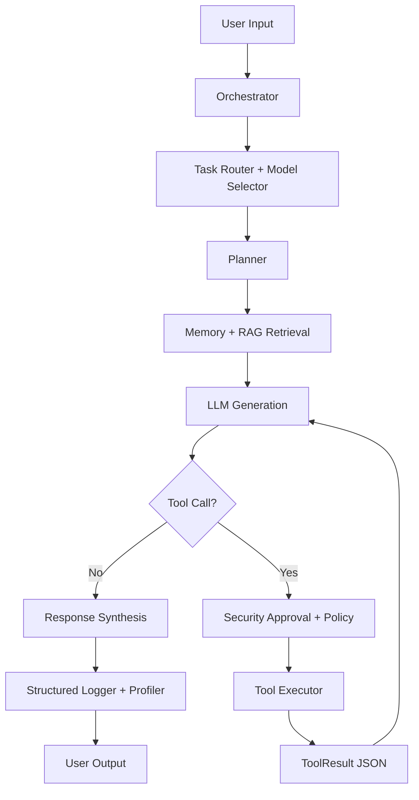
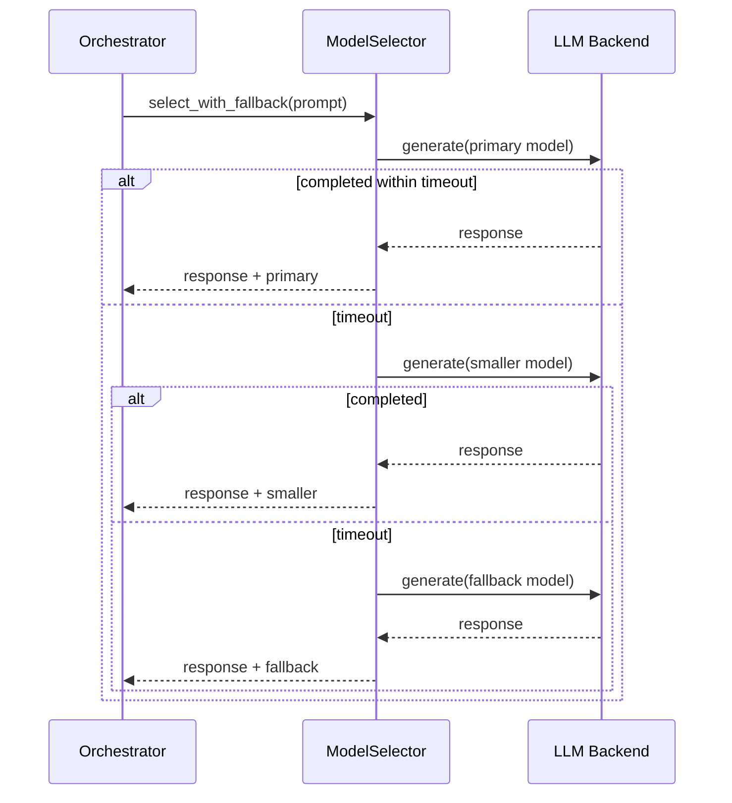
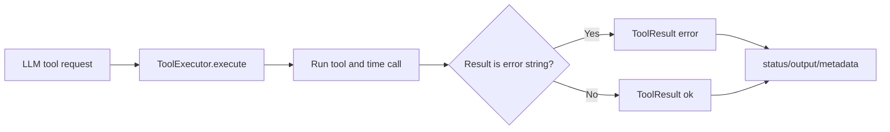

# Embodied AI System — Architecture & Flow Documentation

> **Phase 9 — Core Stack Baseline** | April 2026

## Table of Contents
1. [System Architecture](#system-architecture)
2. [Data Flow Diagrams](#data-flow-diagrams)
3. [Orchestration Models](#orchestration-models)
4. [Component Interactions](#component-interactions)
5. [State Management](#state-management)
6. [Error Handling & Recovery](#error-handling--recovery)
7. [Performance Characteristics](#performance-characteristics)
8. [Mermaid Workflows](#mermaid-workflows)

---

## System Architecture

### Layered Architecture Model

```
┌─────────────────────────────────────────────────────────────────┐
│                   PRESENTATION LAYER                            │
│  ┌──────────────┬──────────────┬──────────────┬──────────────┐  │
│  │   CLI REPL   │  Voice I/O   │  Dashboard   │   APIs       │  │
│  └──────────────┴──────────────┴──────────────┴──────────────┘  │
└─────────────────────────────────────────────────────────────────┘
                              │
┌─────────────────────────────────────────────────────────────────┐
│                   ORCHESTRATION LAYER                           │
│  ┌─────────────────────────────────────────────────────────┐   │
│  │  Orchestrator: Task routing, mode selection, state mgmt │   │
│  └──────┬────────────────────────┬────────────────────┬────┘   │
│         │                        │                    │        │
│  ┌──────▼─────────┐  ┌──────────▼──────────┐  ┌─────▼──────┐ │
│  │  TaskPlanner   │  │ StructuredLogger    │  │ Cognition  │ │
│  │  (multi-step)  │  │ (audit trail)       │  │ Engine     │ │
│  └────────────────┘  └─────────────────────┘  └─────┬──────┘ │
│                                                      │        │
│                                          ┌───────────▼───────┐ │
│                                          │   Ollama Client   │ │
│                                          │   (LLM inference) │ │
│                                          └───────────────────┘ │
└─────────────────────────────────────────────────────────────────┘
                              │
┌─────────────────────────────────────────────────────────────────┐
│                    EXECUTION LAYER                              │
│  ┌──────────────────┬──────────────────┬─────────────────────┐ │
│  │  ToolExecutor    │  SecurityManager │  Sandbox            │ │
│  │  (dispatch)      │  (permissions)   │  (resource limits)  │ │
│  └──────────────────┴──────────────────┴─────────────────────┘ │
│                                                                 │
│  ┌──────────────────┬──────────────────┬─────────────────────┐ │
│  │ FileSystemTools  │ PythonExecTool   │ IoT/Network Tools   │ │
│  └──────────────────┴──────────────────┴─────────────────────┘ │
└─────────────────────────────────────────────────────────────────┘
                              │
┌─────────────────────────────────────────────────────────────────┐
│                    MEMORY & STATE LAYER                         │
│  ┌──────────────────┬──────────────────┬─────────────────────┐ │
│  │  RAGSystem       │  ChromaDB        │  Session Storage    │ │
│  │  (context)       │  (embeddings)    │  (conversations)    │ │
│  └──────────────────┴──────────────────┴─────────────────────┘ │
└─────────────────────────────────────────────────────────────────┘
                              │
┌─────────────────────────────────────────────────────────────────┐
│                  INTEGRATION LAYER                              │
│  ┌─────────────────────────┬──────────────┬──────────────────┐ │
│  │  IoT Manager            │  Device      │  Home Assistant  │ │
│  │  NetworkDiscovery       │  Registry    │  Client          │ │
│  │  LocalNetworkScanner    │  SQLite DB   │                  │ │
│  └─────────────────────────┴──────────────┴──────────────────┘ │
└─────────────────────────────────────────────────────────────────┘
```

### Component Dependency Graph

```
main.py (entry point)
├── Orchestrator (config, logger)
│   ├── TaskPlanner
│   ├── StructuredLogger
│   │   └── Logger (Python built-in)
│   ├── CognitionEngine
│   │   ├── OllamaClient (HTTP, `models/ollama_client.py`)
│   │   ├── ModelSelector (auto task-routing, `models/selector.py`)
│   │   └── RAGSystem
│   │       ├── ChromaDB (persistent)
│   │       └── SentenceTransformer (embeddings)
│   ├── ToolExecutor (tools list)
│   │   ├── FileSystemTools
│   │   ├── PythonExecuteTool
│   │   ├── CodeExecutionTools
│   │   └── IoT/NetworkTools
│   │       └── IoTManager
│   │           ├── LocalNetworkScanner
│   │           ├── NetworkDiscovery
│   │           ├── IoTDeviceRegistry (SQLite)
│   │           ├── HomeAssistantClient (HTTP)
│   │           └── IoTCommandTranslator
│   ├── SecurityManager
│   │   └── Sandbox (resource limits)
│   ├── RAGSystem (shared context)
│   ├── VoiceLoop (optional)
│   │   ├── WhisperSTT (`voice/stt.py`) — audio → text
│   │   └── TTSEngine (`voice/tts.py`) — text → audio
│   └── ScienceLayer (Phase 6+)
│       ├── SimulationEnvironment (`science/simulation.py`)
│       ├── ScientificLiteratureSystem (`science/literature.py`)
│       ├── HybridModelTrainer (`science/hybrid_model.py`)
│       └── ExperimentTracker (`science/experiment_tracker.py`)
└── UI Layer
    ├── Dashboard (FastAPI + Uvicorn, `ui/dashboard_api.py`)
    ├── DashboardAPI (WebSocket/REST + `/api/science/*`)
    └── DesktopApp (PyQt6, `ui/desktop_app.py`)
        ├── DesktopVoiceController (`ui/desktop/voice_controller.py`)
        └── DiagnosticsPanel (`ui/desktop/widgets/diagnostics_panel.py`)
```

---

## Data Flow Diagrams

### Modern Orchestration Workflow (Mermaid)



### Complete Request-Response Cycle

```
┌──────────────┐
│ User Input   │ (text, voice, API call)
└──────┬───────┘
       │
       ▼
┌──────────────────────────────┐
│ 1. Parse & Validate Input    │
│    - Normalize text          │
│    - Extract parameters      │
│    - Validate format         │
└──────┬───────────────────────┘
       │
       ▼
┌──────────────────────────────┐
│ 2. Log Request               │
│    StructuredLogger.log()    │
│    - Timestamp               │
│    - Session ID              │
│    - User input              │
│    - Audit trail             │
└──────┬───────────────────────┘
       │
       ▼
┌──────────────────────────────┐
│ 3. Detect Task Type          │
│    TaskPlanner.plan()        │
│    - Single turn?            │
│    - Multi-step?             │
│    - Tool required?          │
└──────┬───────────────────────┘
       │
       ▼
┌──────────────────────────────┐
│ 4. Retrieve Context          │
│    RAGSystem.retrieve()      │
│    - Query → embedding       │
│    - Search ChromaDB         │
│    - Return top-k chunks     │
└──────┬───────────────────────┘
       │
       ▼
┌──────────────────────────────┐
│ 5. Build LLM Prompt          │
│    - System prompt           │
│    - Context chunks          │
│    - User query              │
│    - Tool definitions        │
└──────┬───────────────────────┘
       │
       ▼
┌──────────────────────────────┐
│ 6. Call Ollama               │
│    CognitionEngine.infer()   │
│    - HTTP POST to localhost:11434 │
│    - Streaming response      │
│    - Parse tokens            │
└──────┬───────────────────────┘
       │
       ▼
┌──────────────────────────────┐
│ 7. Tool Detection            │
│    - LLM requested tool?     │
│    - Parse tool call         │
│    - Validate parameters     │
└──────┬───────────────────────┘
       │
       ├─ NO TOOL ────────────────────────┐
       │                                  │
       │ YES, TOOL REQUIRED               │
       ▼                                  │
┌──────────────────────────────┐       │
│ 8. Check Permissions         │       │
│    SecurityManager.allow()   │       │
│    - Domain check            │       │
│    - Service check           │       │
│    - Entity check            │       │
└──────┬───────────────────────┘       │
       │                                │
       ├─ DENIED ─────────────────────┐ │
       │                              │ │
       │ APPROVED                     │ │
       ▼                              │ │
┌──────────────────────────────┐     │ │
│ 9. Execute Tool              │     │ │
│    ToolExecutor.execute()    │     │ │
│    - Sandbox                 │     │ │
│    - Timeout protection      │     │ │
│    - Error handling          │     │ │
└──────┬───────────────────────┘     │ │
       │                              │ │
       ├─ Tool result ────────────────┤ │
       │                              │ │
       ▼                              │ │
┌──────────────────────────────┐     │ │
│ 10. Refine with Tool Output  │     │ │
│     (Loop back to step 6)    │     │ │
│     - Append tool result     │     │ │
│     - Call LLM again         │     │ │
│     - Until no more tools    │     │ │
└──────┬───────────────────────┘     │ │
       │                              │ │
       └──────────────┬───────────────┘ │
                      │                 │
                      ▼                 │
┌──────────────────────────────┐       │
│ 11. Format Response          │◄──────┘
│     - Trim tokens            │
│     - Extract text           │
│     - Format for output      │
└──────┬───────────────────────┘
       │
       ▼
┌──────────────────────────────┐
│ 12. Log Response             │
│     StructuredLogger.save()  │
│     - Full conversation      │
│     - Tools used             │
│     - Performance metrics    │
└──────┬───────────────────────┘
       │
       ▼
┌──────────────────────────────┐
│ 13. Output Response          │
│     - CLI: Print             │
│     - Voice: TTS → speak     │
│     - Dashboard: WebSocket   │
└──────────────────────────────┘
```

### Network Discovery Flow

```
User calls: manager.discover_devices()
│
├─────────────────────────────────────┐
│                                     │
▼                                     ▼
LocalNetworkScanner              NetworkDiscovery
├─ Get adapter profiles         ├─ ARP table parsing
├─ Perform ARP sweep            ├─ Safe port scanning
├─ Optional: UPnP probe         ├─ Device classification
├─ Port scanning               ├─ Vendor lookup
└─ Return: List[host_dict]     └─ SQLite storage
       │                             │
       │    └─ scan_id + timestamp ──┘
       │
       └─────────────────┬──────────────────┐
                         │                  │
                         ▼                  ▼
            ┌──────────────────────────────┐
            │ _merge_discovery_results()   │
            │                              │
            │ Input: scanner_hosts +       │
            │        discovery_hosts       │
            │                              │
            │ Processing:                  │
            │ 1. Deduplicate by IP         │
            │ 2. Merge port lists (union)  │
            │ 3. Keep highest confidence   │
            │ 4. Mark source attribution   │
            │                              │
            │ Output: List[merged_host]    │
            └──────────┬───────────────────┘
                       │
                       ▼
            ┌──────────────────────────────┐
            │ device_registry.register()   │
            │ - Update internal state      │
            │ - Cache for queries          │
            └──────────┬───────────────────┘
                       │
                       ▼
         Return: {
           ok: bool,
           scanner_hosts_seen: int,
           discovery_hosts_seen: int,
           merged_hosts_registered: int,
           arp_discovery: dict,
           inventory: dict
         }
```

### Memory/RAG Context Retrieval Flow

```
User Query: "Tell me about my saved notes"
│
▼
embed_query("Tell me about my saved notes")
    │
    └─ SentenceTransformer.encode()
       └─ Returns: embedding vector (384 dims)
│
▼
ChromaDB.query(
       query_embeddings=[vector],
       n_results=5,
       where={"metadata": "user_notes"}
)
       │
       └─ Semantic search in collection
          └─ Return top-5 most similar chunks
│
▼
Format context chunk:
       [SOURCE: filename.txt | timestamp]
       [RELEVANCE: 0.92]
       "Text of the relevant chunk here..."
│
▼
Build LLM prompt:
       System: "You are an AI assistant..."
       Context: [top-5 chunks formatted]
       User: "Tell me about my saved notes"
│
▼
CognitionEngine → Ollama → Response
```

---

## Mermaid Workflows

### Timeout-Aware Model Fallback



### Tool Execution Contract



---

## Orchestration Models

### Model 1: Inline Tool Execution (Default)

**When to use:** Fast responses, simple tools, no approval needed

```
Request
├─ LLM inference
├─ Tool detected?
│  └─ Execute immediately
├─ Parse tool output
├─ LLM refinement
└─ Return response
```

**Latency:** ~2-5 seconds (depending on tool)

### Model 2: Deferred Approval (Phase 6)

**When to use:** Sensitive operations, high-risk tools

```
Request
├─ LLM inference
├─ Tool detected?
│  ├─ Check security policy
│  ├─ If sensitive: Queue for approval
│  │  ├─ Send to SecurityManager
│  │  ├─ Wait for human approval
│  │  └─ If approved: Execute
│  │  └─ If denied: Return rejection
│  └─ If safe: Execute immediately
├─ Parse tool output
├─ LLM refinement
└─ Return response
```

**Latency:** ~5-60 seconds (waiting for approval)

### Model 3: Async Task Processing (Planned)

**When to use:** Long-running tasks, background jobs

```
Request
├─ LLM inference
├─ Tool detected?
│  ├─ If long-running:
│  │  ├─ Queue in background
│  │  ├─ Return task_id immediately
│  │  └─ Process asynchronously
│  └─ If fast:
│     └─ Execute inline
├─ LLM refinement
└─ Return response + task_id
```

**Latency:** ~1-2 seconds (response), task completes in background

### Model 4: Streaming Inference (Dashboard)

**When to use:** Real-time feedback in UI

```
Request
├─ Build prompt
├─ Ollama streaming
│  ├─ For each token received:
│  │  ├─ Emit via WebSocket
│  │  ├─ Update dashboard UI
│  │  └─ Buffer for tool detection
│  └─ When token stream completes
├─ Parse for tools
├─ Execute tools
├─ Stream refinement results
└─ Update final response
```

**Latency:** Real-time token streaming, ~1-5 seconds total

---

## Component Interactions

### Task Planning Sequence

```
User: "Save my notes and upload them"

1. TaskPlanner.plan(query)
   └─ Analyze query
   └─ Detect multi-step nature
   └─ Break into steps:
      [Step 1] Identify "notes" reference
      [Step 2] Save notes to file
      [Step 3] Upload to destination
      [Step 4] Confirm completion

2. For each step:
   ├─ Execute step
   ├─ Capture results
   ├─ Store in context
   └─ Feed to next step

3. Integrate all results
   └─ LLM synthesizes final response
      "I've saved your notes to /data/notes.txt
       and uploaded to the backup server."
```

### Tool Execution Sequence

```
User: "What files are in the data directory?"

1. CognitionEngine receives query
   └─ Infers tool needed: file_list_tool

2. ToolExecutor checks permissions
   ├─ Domain: file_system
   ├─ Service: read
   └─ Allowed? YES

3. ToolExecutor.execute(
       tool_name='list_directory',
       args={'path': 'data'}
   )
   ├─ Create sandbox
   ├─ Set resource limits
   ├─ Call tool
   └─ Capture output

4. Output: [files list from OS]

5. CognitionEngine.refine()
   ├─ Receives tool output
   ├─ Builds new prompt
   ├─ Sends to Ollama
   └─ Generates human-readable response
```

### Home Assistant Integration Sequence

```
User: "Turn on the bedroom light"

1. CognitionEngine infers intent
   └─ Intent: light_control
   └─ Action: turn_on
   └─ Target: bedroom_light

2. IoTCommandTranslator.translate()
   ├─ Input: (intent, target, args)
   ├─ Lookup in registry
   ├─ Map to HA service
   └─ Output: {domain, service, entity_id}

3. IoTManager.control_device()
   ├─ domain='light'
   ├─ service='turn_on'
   ├─ entity_id='light.bedroom_light'
   └─ HomeAssistantClient.call_service()

4. HomeAssistantClient
   ├─ Build HA service call
   ├─ HTTP POST to HA server
   ├─ Wait for response
   └─ Return {ok, result}

5. ToolExecutor receives result
   ├─ Success?
   ├─ Append to LLM context
   ├─ LLM confirms "Light turned on"
   └─ Return to user
```

---

## State Management

### Session State

```python
class SessionState:
    """Per-session state maintained in memory"""
    
    session_id: str                    # Unique ID
    created_at: datetime               # Start time
    conversation: List[Message]        # All turns
    tools_used: List[str]             # Tool names used
    rag_context: List[str]            # Retrieved chunks
    user_preferences: Dict[str, Any]  # Learned preferences
    device_registry: Dict[str, Device] # Known devices
    security_approvals: Dict[str, bool] # Cached approvals
    last_activity: datetime            # Last request time
```

### Persistent State (Disk)

```
logs/
├── sessions/
│   ├── {session_id}.jsonl          # Per-session structured log
│   └── ...
├── cognition/                      # LLM inference cache
├── tasks/                          # Task execution logs
└── security/                       # Approval audit trail

data/
├── chroma_db/                      # RAG embeddings
├── network_discovery.db            # Network scan history
└── device_cache.json               # Device registry backup
```

### State Transitions

```
┌──────────────┐
│  Idle        │
└──────┬───────┘
       │ User input
       ▼
┌──────────────┐
│  Processing  │
└──────┬───────┘
       │
       ├─ Tool required
       │  │
       │  ├─ Permission denied
       │  │  └─► Rejected
       │  │
       │  └─ Permission granted
       │     └─► Executing tool
       │        │
       │        ├─ Success
       │        │  └─► Refining (back to Processing)
       │        │
       │        └─ Error
       │           └─► Error response
       │
       ├─ No tool
       │  └─► Ready to respond
       │
       ▼
┌──────────────┐
│  Responding  │
└──────┬───────┘
       │
       ▼
┌──────────────┐
│  Idle        │
└──────────────┘
```

---

## Error Handling & Recovery

### Exception Hierarchy

```
Exception
├── OllamaClientError
│   ├─ ConnectionError (can't reach Ollama)
│   ├─ TimeoutError (inference too slow)
│   └─ ModelNotFoundError (requested model missing)
├── ToolExecutionError
│   ├─ PermissionDeniedError (not allowed)
│   ├─ ToolNotFoundError (tool doesn't exist)
│   ├─ SandboxError (execution failure)
│   └─ TimeoutError (tool ran too long)
├── RAGError
│   ├─ DatabaseError (ChromaDB failure)
│   ├─ EmbeddingError (can't embed query)
│   └─ QueryError (no results)
└── IntegrationError
    ├─ HomeAssistantError (HA unreachable)
    ├─ NetworkError (network discovery failed)
    └─ DeviceError (device operation failed)
```

### Recovery Strategies

```
Ollama disconnected?
├─ Retry 3 times with exponential backoff
├─ If still failed: Wait 10s, retry indefinitely
└─ Message user: "LLM service reconnecting..."

Tool execution timeout?
├─ Kill tool process
├─ Return timeout error
└─ Log incident for security review

Network discovery failure?
├─ Try fallback subnet detection
├─ Return cached results if available
└─ Log network state for debugging

ChromaDB corrupted?
├─ Attempt repair (PRAGMA integrity_check)
├─ If failed: Reinitialize from backup
└─ Alert user: "Memory service recovering..."
```

---

## Performance Characteristics

### Latency Profile

```
Operation                     Median    P95       Max
──────────────────────────────────────────────────────
Parse input                   10ms      50ms      100ms
Retrieve context (RAG)        200ms     500ms     2s
LLM inference (fast query)    1s        3s        10s
LLM inference (complex)       5s        15s       30s
Tool execution (file)         100ms     500ms     5s
Tool execution (network)      500ms     2s        10s
Device discovery              5s        30s       60s
Response formatting           100ms     500ms     1s

Total P50 (simple query):     ~2s
Total P95 (tool usage):       ~5-10s
Total P99 (network discovery):~30-60s
```

### Resource Usage

```
Memory:
├─ Base system:     ~100MB
├─ Per session:     ~10-50MB
├─ ChromaDB cache:  ~500MB (scales with docs)
└─ Ollama model:    ~4GB (depends on model size)

Disk:
├─ Logs (monthly):  ~100-500MB
├─ ChromaDB:        ~1GB per 10k documents
└─ Models:          ~5-10GB per model

Network:
├─ Ollama requests: ~1-5KB per query
├─ HA API calls:    ~500B-5KB per control
└─ Discovery scan:  ~1KB per host (broadcast + responses)
```

### Scalability Limits

```
Concurrent users:        1 (single-machine)
Max conversation length: Limited by context window (2048 tokens)
Max documents in RAG:    Depends on disk (ChromaDB auto-scaling)
Max network size:        Class C subnet (254 devices)
Max devices in HA:       Tested up to 200 entities
Max tool definitions:    Hundreds (limited by memory)

To scale beyond limits:
├─ Deploy distributed: Multiple AI nodes
├─ Add message queue: Kafka/RabbitMQ
├─ Shard data: Multiple ChromaDB instances
└─ Load balance: Nginx/HAProxy
```

---

**Document Version:** 1.0  
**Last Updated:** 2026-04-28  
**Maintainer:** Embodied AI Team
