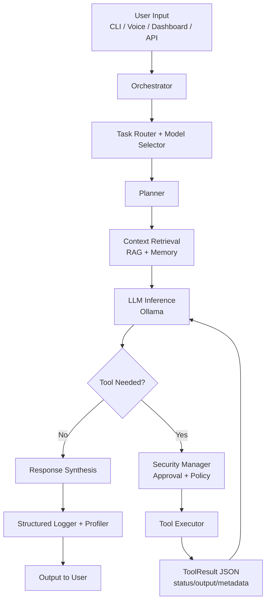
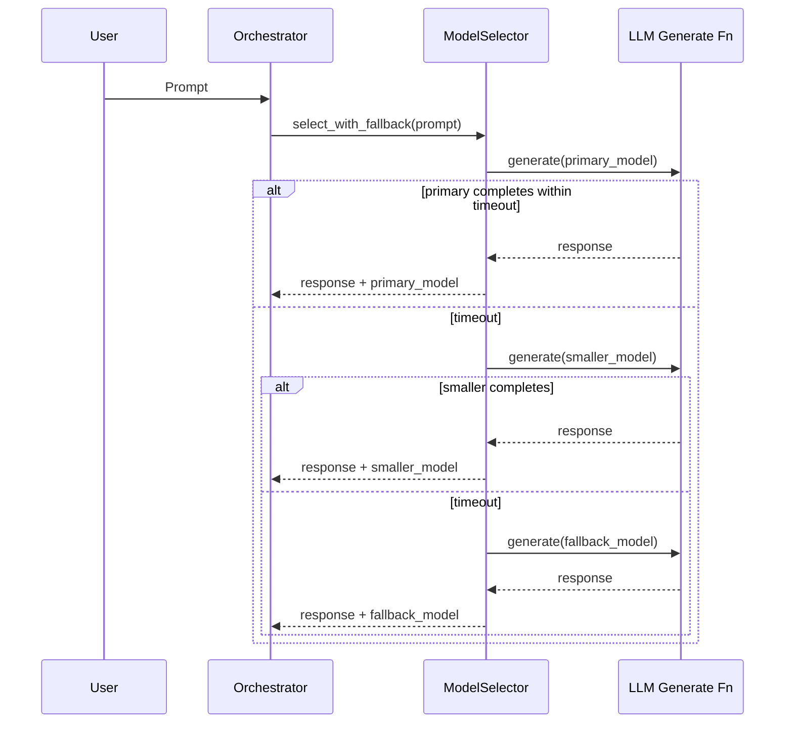

# Embodied AI System - General Summary (Full Picture)

> Last Updated: April 30, 2026  
> Scope: End-to-end system status across core intelligence, RAG, tools, routing, orchestration, security, UI, voice, IoT, and training.

## 1. What This System Is

Embodied AI System is a local-first AI platform that runs on your machine with optional internet-restricted integrations. It combines:

- Local LLM inference (Ollama)
- Multi-step orchestration and tool use
- RAG memory with ChromaDB
- Security approvals and sandboxed execution
- Dashboard + desktop + CLI/REPL + voice interfaces
- IoT/network control and discovery
- Science lab workflows
- LoRA dataset/training/export pipeline

Primary deployment target is private, offline-capable operation with auditable logs.

## 2. Runtime Architecture Snapshot

## 3. Core Capabilities (Current)

### RAG and Memory
- Chunking pipeline with target token sizing and chunk metadata
- ChromaDB persistent vector store
- Semantic retrieval + reranking support
- Batch embedding path (`embed_batch`) with local embedding cache
- Orchestrator memory injection into step prompts

### Tooling and Security
- Tool registry with dispatch (`ToolExecutor`)
- File read/write/list and Python execution tools
- Tool security authorization and approval queue
- Sandbox support for code execution with timeout controls
- Standardized tool responses (`ToolResult`):
  - `status`: `ok` or `error`
  - `output`: raw or structured output
  - `metadata`: timing and tool-level metadata

### Routing and Orchestration
- Intent/task classification for model routing
- Dynamic model selection based on availability and task affinity
- Timeout-aware fallback chain:
  - primary selected model
  - smaller model retry on timeout
  - hard fallback model
- Multi-step planning with retry loop and synthesis

### Performance and Observability
- Structured JSONL audit logs per session
- Rotating operational logs
- Request profiler utility (`core/profiler.py`) for:
  - span timings
  - token usage counters
  - GPU memory snapshot
- Configurable performance settings in `config/phase4_config.yaml`

### Interfaces
- REPL and CLI modes
- FastAPI dashboard + science endpoints
- Desktop app (PyQt6)
- Voice loop (Whisper STT + multiple TTS backends)

### IoT and Network
- Device discovery and inventory merging
- Home Assistant integration hooks
- Safe network scanning defaults

### Training
- LoRA pipeline (dataset build, train, export, evaluate)
- Dataset schema for Alpaca-style records
- GPU-oriented settings for local fine-tuning

## 4. Configuration Model

Main operational config: `config/phase4_config.yaml`

Key sections:
- `ollama`: model, fallback, context, timeout
- `model_routing`: per-task preferred models
- `memory`: embedding model, DB path, retrieval settings
- `agent`: iteration/time limits, tool execution controls
- `security`: permissions, approvals, sandbox policy
- `logging`: structured logs, levels, debug mode
- `performance`: embedding batch size, VRAM thresholds, profiling toggle
- `api`, `voice`, `iot`, `features`

## 5. Workflow Diagram - Timeout Fallback Routing

## 6. Documentation Map

- `README.md`: primary operator/developer overview
- `GENERAL_SUMMARY_README.md`: this high-level full-picture summary
- `ARCHITECTURE_AND_FLOW.md`: deep architecture and process flows
- `CODE_DOCUMENTATION.md`: module-level technical reference
- `DOCUMENTATION_INDEX.md`: navigation and reading paths
- `DEVELOPMENT_GUIDE.md`: engineering conventions and extension patterns

## 7. Validation Notes (April 30, 2026)

- Core runtime paths were re-reviewed for maintainability comments in:
  - `rag/embeddings.py`
  - `models/selector.py`
  - `tools/base_tools.py`
  - `core/profiler.py`
- Documentation timestamps and status references were updated to match current Phase 9+ implementation state.
- New Mermaid workflow diagrams were added to reflect current routing and orchestration behavior.

## 8. Known Environment Constraint

Some local test runs can fail before execution due to unrelated package ABI mismatch in the environment (`NumPy 2.x` with older `SciPy`/`scikit-learn` wheels). This affects import-time checks in modules that depend on sentence-transformers/scikit-learn stack. It is not caused by documentation/comment updates.

## 9. Next Operational Steps

1. Keep `phase4_config.yaml` as the single source of runtime truth.
2. Use `GENERAL_SUMMARY_README.md` + `ARCHITECTURE_AND_FLOW.md` for onboarding.
3. Add a docs check in CI to enforce date/status updates on release.
4. Consider pinning compatible `numpy/scipy/sklearn` versions in environment docs for deterministic smoke tests.
